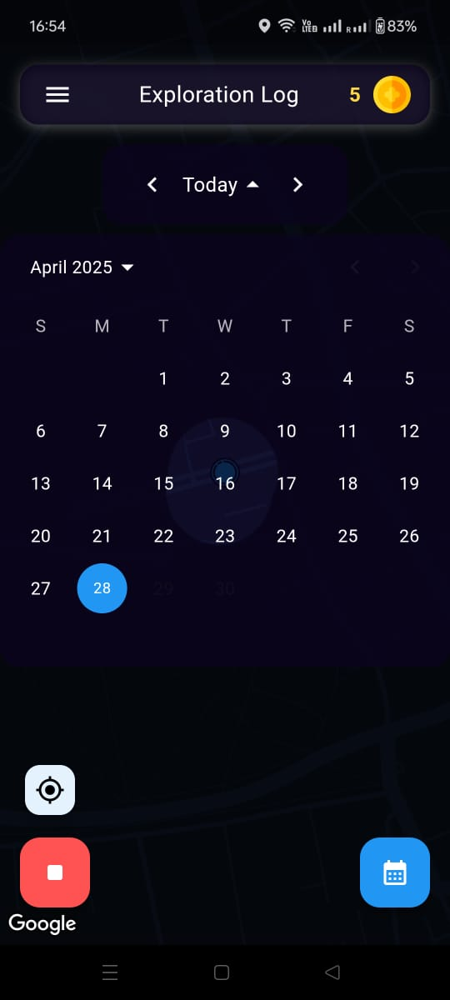
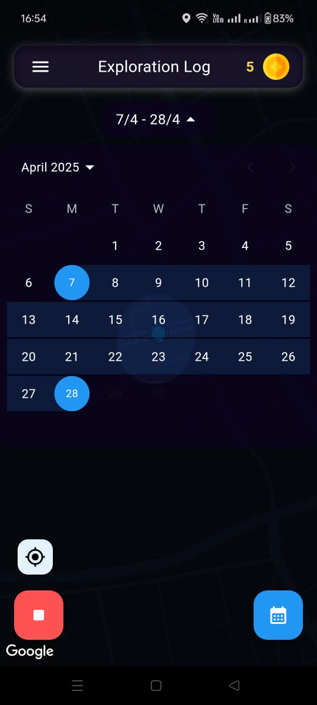
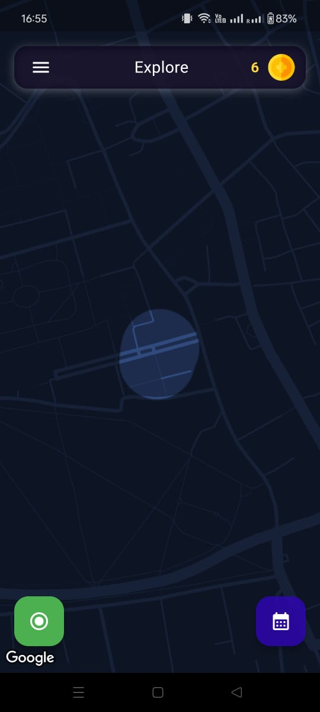
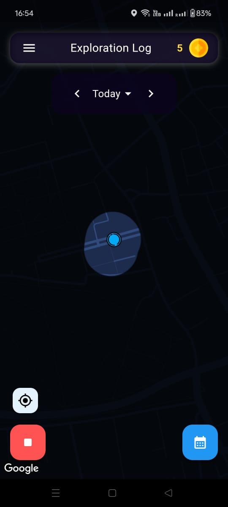
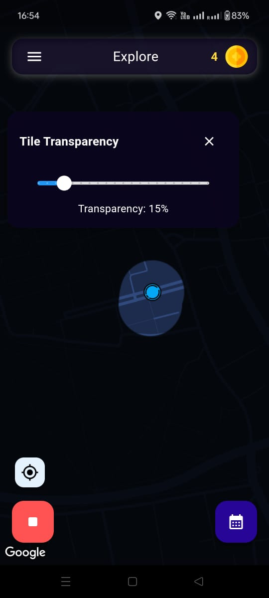
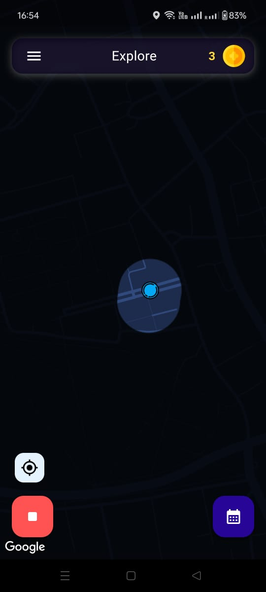

# Exploration Log 🗺️✨

 

Turn your everyday movements into an adventure! Exploration Log tracks your journeys, revealing a map of your world as you explore it, piece by piece. Gamify your discoveries and keep a log of where you've been.

---

## Key Features

*   **📍 Real-time Location Tracking:** Records your path accurately as you move.
*   **🤫 Background Recording:** Start tracking and let the app run seamlessly in the background, capturing your entire journey without needing the app open.
*   **🌫️ Exploration Map:** The map starts opaque! Areas you visit are automatically cleared, visually revealing the places you've explored.
*   **📅 Exploration Log Calendar:** Review your past explorations easily.
    *   View activity for specific **single dates**.
    *   Filter explorations across **custom date ranges**.
    *   Quickly jump to **"Today's"** activity.
*   **🪙 Exploration Coins:** Earn rewards (coins) based on the amount of area you uncover. See your balance grow as you explore more!
*   **💧 Adjustable Tile Transparency:** Customize the look of your explored map areas by adjusting the opacity of the revealed tiles.
*   **🔒 Local Data Storage:** All your exploration data is saved securely on your device. The data never leaves your phone.

---

## How It Works

1.  **Start Recording:** Simply tap to begin tracking your journey.
2.  **Explore:** Go about your day! Walk, drive, cycle - the app will track you in the background (The app needs to be running in background and location is available at all times)(High battery usage).
3.  **Reveal the Map:** As you move, the map tiles you pass through will become visible.
4.  **Review:** Check the "Exploration Log" calendar to see where and when you've explored.
5.  **Customize:** Adjust map transparency to your liking.

---

## Screenshots

Here's a glimpse of Exploration Log in action:

**1. Exploration Log Calendar (Daily View)**
 

 
*Caption: View your exploration activity for a specific day.*

---

**2. Exploration Log Calendar (Range View)**
 

 
*Caption: Filter your exploration log by a custom date range.*

---

**3. Main Map View (Exploring)**
 

 
*Caption: Real-time tracking reveals the map as you move.*

---

**4. Map View (More Exploration)**
 

 
*Caption: Uncover more of the map the further you explore.*

---

**5. Tile Transparency Control**
 

 
*Caption: Adjust the opacity of explored map tiles.*

---

**6. Coin Balance**
 

 
*Caption: Track your earned exploration coins.*

---

## Getting Started

*   **Android:** Download the latest `.apk` file from the link below and install it on your device.
    *   [**Download APK**](releases/Explore.apk)
*   **iOS:** An iOS version is planned and currently under development. Stay tuned for updates!

---
---

## Get in Touch 💬

Feel free to reach out if you have questions, feedback, or collaboration ideas!

*   **LinkedIn:** [Hardik Gupta](https://www.linkedin.com/in/hardikgup/)
*   **Email:** Drop me a mail at [hardik4869@gmail.com](mailto:hardik4869@gmail.com)